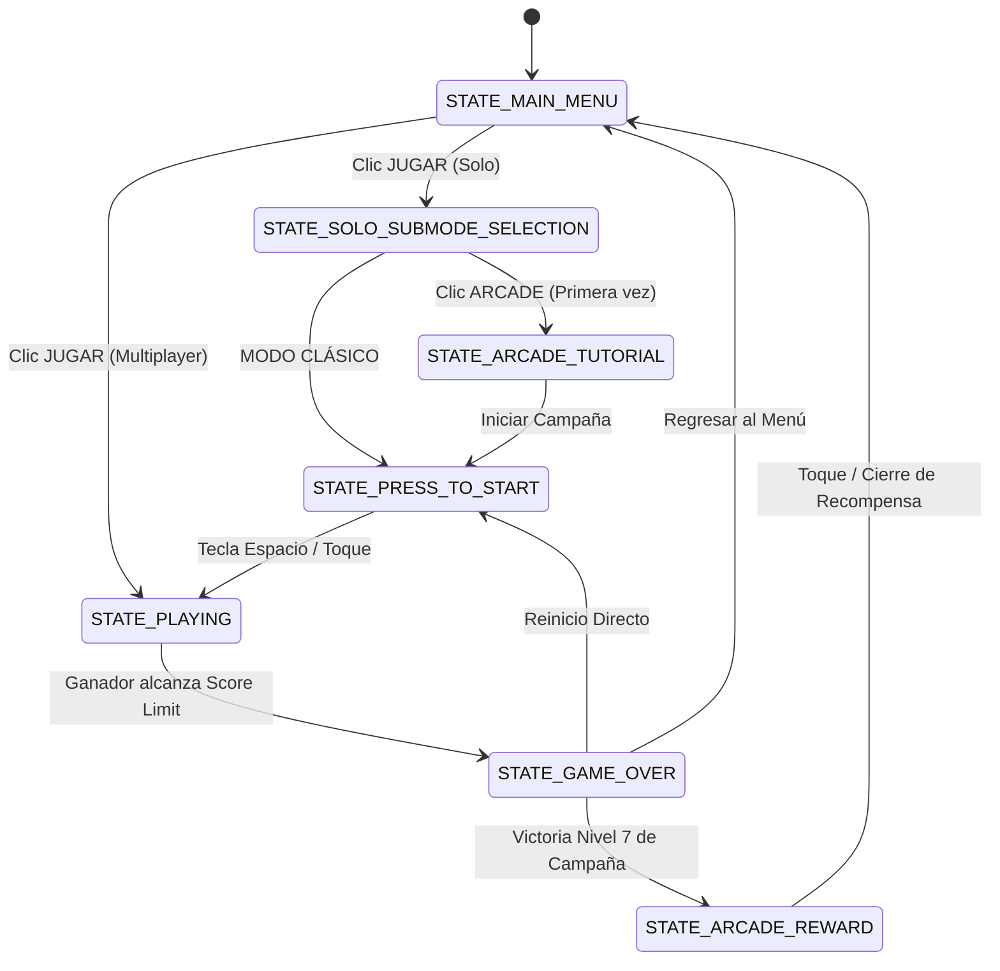

# Informe de Arquitectura - Pong Kombat v0.7.2

Este documento detalla el diseño de software, los patrones arquitectónicos y la estructura modular de **Pong Kombat**, un videojuego premium en 2D desarrollado en Python con **Pygame**, optimizado tanto para entornos de escritorio como para navegadores web y dispositivos móviles mediante **Pygbag (WebAssembly)**.

---

## 1. Visión General y Objetivos de Diseño

El diseño arquitectónico de **Pong Kombat** se ha estructurado bajo tres pilares fundamentales:
1. **Modularidad e Independencia de Componentes**: Separación estricta de las entidades del juego, el motor de físicas, el renderizado de interfaces y la lógica del ciclo principal.
2. **Hibridez de Entradas (PC / Dispositivos Móviles)**: Soporte transparente para teclado en ordenadores y zonas táctiles de entrada multitáctil adaptativas para celulares.
3. **Rendimiento Óptimo en WebAssembly**: Mitigación de cuellos de botella clásicos del compilador Emscripten, tales como la sobrecarga por renderizado dinámico de fuentes o fallos en hilos de audio independientes.

---

## 2. Patrón Arquitectónico General: Orchestrator-Delegates (Mediador)

El juego implementa una variante del patrón **Mediador / Orquestador**. La clase central **`Game`** (definida en `game_engine.py`) actúa como el núcleo central que coordina y comparte el estado del sistema, mientras delega responsabilidades críticas a manejadores especializados y autocontenidos.

```
                           +------------------------+
                           |       main.py          |
                           +-----------+------------+
                                       |
                                       v
                           +------------------------+
                           |      Game (Core)       |
                           +-----------+------------+
                                       |
     +-------------+-----------+-------+-------+---------------+-------------+
     |             |           |               |               |             |
     v             v           v               v               v             v
+----+----+  +-----+----+  +---+----+  +-------+------+  +-----+----+  +-----+----+
| Paddle  |  |   Ball   |  | Physics|  | MenuManager  |  | VFXManager|  | Audio    |
| (Entity)|  | (Entity) |  | Engine |  | (UI Render)  |  | (Particles|  | Manager  |
+---------+  +----------+  +--------+  +--------------+  +-----------+  +----------+
```

Este esquema de delegación evita el antipatrón *God Class* en el ciclo de ejecución (`run()` / `run_async()`), permitiendo que el bucle de juego principal simplemente distribuya los ticks de tiempo (`dt`), eventos de entrada y llamadas de dibujo.

---

## 3. Desglose de Módulos y Responsabilidades

### A. Core Engine (`Game` en `game_engine.py`)
*   **Responsabilidad**: Inicializar el contexto de Pygame, coordinar la máquina de estados lúdicos, capturar los eventos de entrada del usuario (teclado, ratón y toques multitáctiles en móviles) y dirigir el bucle de renderizado global.
*   **Lógica Destacada**: Administra el escalado dinámico a resolución lógica `800x600` mediante banderas de hardware (`pygame.SCALED | pygame.RESIZABLE`) y realiza el guardado/carga del progreso del jugador en formato JSON (`save_data.json`).

### B. Módulo de Entidades (`entities.py`)
Encapsula el estado, las variables internas de juego y las rutinas de dibujado de cada objeto en pantalla.
*   **`Paddle` (Paletas)**: Almacena coordenadas de sub-píxel, lógica de recarga de habilidades, estados alterados (inmovilización por sueño, gum power), barras de carga lógicas y la nueva mecánica de **Meditación (Reloj Violeta)**.
*   **`Ball` (Pelotas)**: Soporta múltiples tipos de esferas lógicas concurrentes (pelota normal, de fuego, de oro x2, pelota fantasma y balas de revólver), gestionando sus propios vectores de velocidad y modificadores de aspecto (skins).
*   **`Mouse` (Ratón Intruso)**: Entidad autónoma que persigue la pelota en el modo modificador respectivo, forzando la conversión de la pelota a tipo "Queso".
*   **`SleepProjectile` / `GumProjectile`**: Proyectiles asociados a poderes que viajan a través del campo interactuando con las paletas de forma asíncrona.
*   **`Particle` / `Cloud`**: Entidades visuales puras que agregan fidelidad estética al campo de juego.

### C. Motor de Físicas (`PhysicsEngine` en `physics_engine.py`)
*   **Responsabilidad**: Aislar todo cálculo vectorial y de colisiones fuera del bucle del juego.
*   **Física Avanzada**:
    *   **Gravedad Planetaria**: Aplica fuerzas de aceleración centrípeta hacia los planetas flotantes en base al radio de atracción gravitacional de manera no destructiva (curva la trayectoria conservando la energía cinética del vector de la bola).
    *   **Portales Dimensionales**: Resuelve intersecciones de colisiones bidimensionales AABB, reubicando la pelota y aplicando impulsos de velocidad instantáneos con correcciones de desfase vertical u horizontal.
    *   **Manejo de Rebotadores y Habilidades**: Resuelve colisiones elásticas contra las paletas aplicando incrementos graduales basados en golpes consecutivos.

### D. Gestor de Efectos Visuales (`VFXManager` en `vfx_manager.py`)
*   **Responsabilidad**: Centralizar y procesar elementos estéticos transitorios sin interrumpir la consistencia del gameplay.
*   **Características**: Controla explosiones de partículas por paleta/portal, lluvias de confeti de victoria, ráfagas estelares e impulsos temporales de sacudida de cámara (Screen Shake) aplicando desvíos matemáticos aleatorios sobre la superficie de dibujo en el dibujado final.

### E. Gestor de Audio (`AudioManager` en `audio_manager.py`)
*   **Responsabilidad**: Servir como interfaz unificada de sonido para música en bucle y efectos (SFX).
*   **Adaptabilidad WebAssembly**: Utiliza envoltorios protectores `try...except` en cada carga y reproducción. Esto previene interrupciones fatales causadas por las políticas estrictas de interacción de audio en navegadores web (Autoplay Policies de Chrome/Safari).

### F. Controlador de Inteligencia Artificial (`AIController` en `ai_controller.py`)
*   **Responsabilidad**: Evaluar predicciones del comportamiento de las pelotas en pantalla en tiempo real para guiar los movimientos del oponente artificial en los niveles Solo y la campaña Arcade.
*   **Características**: Implementa variaciones de retraso de reacción (frames perdidos de seguimiento) y desviaciones predictivas de altura según la dificultad asignada al oponente lúdico.

---

## 4. Bucle del Juego y Máquina de Estados

El flujo lógico del videojuego está regulado por una máquina de estados finita basada en cadenas constantes. A continuación se detallan las transiciones lógicas principales:



---

## 5. Implementación de Mecánicas Clave

### Mecánica de Meditación (Reloj Violeta)
*   **Ubicación**: Lógica integrada en `Paddle.update()` en interacción con el estado activo del Reloj Violeta en `Game`.
*   **Cálculo**:
    1.  En cada frame, la paleta registra su coordenada `y` anterior en `self.last_y`.
    2.  Si la paleta se encuentra dentro de su respectiva zona violeta activa (`is_purple`) y no se detecta desplazamiento físico (`self.rect.y == self.last_y`), se incrementa `self.purple_still_timer` por la diferencia de tiempo `dt`.
    3.  Si la inactividad voluntaria se prolonga por **3.0 segundos seguidos**, se ejecuta `grant_random_power()`, se restablece el temporizador y se invoca un efecto visual explosivo en la paleta junto con el timbre de confirmación auditiva.
    4.  Cualquier desvío en las coordenadas del joystick o teclado restablece instantáneamente el temporizador a `0.0`.

### Sistema de Portales Dimensionales
*   **Ubicación**: `PhysicsEngine._check_portal_collisions()`.
*   **Funcionamiento**:
    1.  Se define un portal origen y un portal destino (ej. Azul -> Naranja).
    2.  Al detectarse solapamiento físico en las máscaras de colisión, se calcula la posición relativa de entrada de la bola respecto a los límites del portal origen.
    3.  Se proyecta la misma posición relativa sobre el portal de salida desplazando la coordenada perpendicular para evitar bucles de colisiones infinitas (Teleportation Offset).
    4.  Si los portales están configurados de forma vertical, el vector horizontal `vx` de la bola conserva su sentido, mientras que si son horizontales, el vector vertical `vy` se invierte.

---

## 6. Optimizaciones Críticas para Entornos Web (Pygbag)

1.  **Cacheo de Superficies de Texto**: La instanciación de fuentes tipográficas y su renderizado en Pygame (`font.render`) es un proceso pesado de CPU. Para evitar la ralentización extrema del hilo principal del navegador ("Audio Starvation"), el gestor de texto de Pong Kombat almacena las superficies de texto renderizadas de diálogos extensos (tales como la explicación del tutorial o la felicitación de recompensa) en búferes locales (`self.cached_tutorial_surface`, `self.cached_reward_surface`). Solo se recrean cuando el texto lógico cambia.
2.  **Robustez de Audio WebAssembly**: Todos los métodos de carga de sonido e inicialización del mixer de audio manejan excepciones genéricas y verificaciones dinámicas. Si un navegador bloquea el audio al arranque por directivas de seguridad, el juego arranca de forma segura omitiendo las peticiones auditivas hasta la primera interacción manual de pantalla, previniendo caídas totales de la consola JS de emscripten.
3.  **Hibridez Dinámica de Escala**: El juego maneja todas las posiciones lógicas con una matriz fija de `800x600`. El motor gráfico de Pygame adapta el lienzo a escala en el navegador móvil mediante estiramientos sin pérdida de relación de aspecto gracias al modo `pygame.SCALED`.

---

## 7. Pipeline de Compilación Web y Arquitectura PWA (Celular)

Para lograr un rendimiento óptimo y una compatibilidad multiplataforma transparente en dispositivos móviles y navegadores modernos, el proyecto implementa un completo pipeline de compilación y post-procesamiento en cuatro etapas gestionado por el script integrador **`compilar_web.py`**.

```
+----------------------------------------------------------------------------------------+
|                                  compilar_web.py                                       |
+--------------------+-------------------+--------------------+--------------------------+
                     |                   |                    |
                     v                   v                    v
+--------------------+---+ +-------------+-----+ +-------------+----+ +-------------------+----+
| 1. Compilación Pygbag  | | 2. Copia y Rutas  | | 3. BrowserFS e   | | 4. Rotación y     |
| (WASM y Bytecode)      | | (Saneamiento PWA) | | Interceptores    | | Touch-Mapping JS  |
+------------------------+ +-------------------+ +------------------+ +-----------------------+
```

### A. Fase 1: Compilación a WebAssembly (`pygbag`)
*   **Acción**: Ejecuta `pygbag --disable-sound-format-error --build .` para transpilar el código Python de **Pong Kombat** a bytecode empaquetado y compilar los módulos del motor en un entorno virtualizado en WebAssembly.
*   **Resultado**: Genera la estructura base del directorio `build/web/` con los archivos binarios emscripten y el cargador inicial HTML.

### B. Fase 2: Saneamiento de Rutas y Encapsulado PWA (`arreglar_web.py`)
*   **Desacoplamiento de Servidor**: El script recorre `index.html` y sanitiza expresiones regulares que apunten a direcciones locales de desarrollo (`http://0.0.0.0:8000/`, `localhost`, o IPs específicas), convirtiéndolas a rutas relativas lógicas (`./`). Esto hace que el paquete web compilado sea completamente portátil e independiente de la IP o puerto del servidor de origen.
*   **Inclusión Local de Recursos (BrowserFS)**: Descarga físicamente `browserfs.min.js` e inyecta su inclusión de manera local en lugar de consultar dependencias CDN externas.
*   **Bundling Offline PWA**: Copia los recursos definidos en `web_pwa/` (como `manifest.json`, iconos adaptativos de varios tamaños y el gestor de caché `service-worker.js`) directamente al directorio de distribución final, habilitando la instalación del juego de forma nativa en celulares Android e iOS, y permitiendo su ejecución completa sin conexión a Internet.

### C. Fase 3: Robustecimiento del Sistema de Archivos e Interceptores de Red (`sanitizar_index.py`)
*   **Aislamiento y Mitigación de Caídas de Carga**: Modifica la plantilla de ejecución de Pygbag para corregir discrepancias sintácticas en subprocesos JS, e inyecta bloques protectores `try-catch` para la extracción de tarfiles en BrowserFS, evitando cuellos de botella y bloqueos por permisos en navegadores web móviles estrictos.
*   **Fetch Interceptor (Aislamiento de Entorno)**: Se inyecta un interceptor global a nivel de API Fetch en `index.html`. Este bloque intercepta llamadas salientes de red destinadas a descargar dependencias del núcleo de `pygame_ce` (como las librerías CDN de `pygame-web.github.io/cdn/`) y las redirige de forma instantánea al origen local `/cdn/` del servidor propio. Esto garantiza que el juego cargue y compile sus dependencias de manera autónoma en redes móviles que bloqueen dominios externos o cuenten con firewalls restrictivos.

### D. Fase 4: Fuerza Bruta de Orientación e Intercepción de Coordenadas Táctiles (`forzar_rotacion.py`)
Dado que **Pong Kombat** está diseñado para jugarse en formato horizontal (Landscape) con resolución fija, esta fase inyecta un sistema de fuerza bruta en JS de bajo nivel para celulares que interactúa dinámicamente con el hardware:
1.  **Rotación Física y Escalado por CSS**: Si un dispositivo móvil se encuentra sostenido verticalmente (modo Portrait), reglas CSS inyectadas de forma dinámica rotan el lienzo gráfico (`canvas.emscripten`) a 90 grados mediante transformadas 3D (`transform: translate(-50%, -50%) rotate(90deg)`), ajustando perfectamente la relación de aspecto 4:3 en el ancho del dispositivo sin deformar la imagen.
2.  **Intercepción y Transformación de Coordenadas de Entrada (Touch-Mapping)**: Al rotar físicamente el Canvas por CSS, las coordenadas de toques táctiles (`Touch`) y del cursor del mouse (`MouseEvent`) quedan desalineadas respecto a la posición lógica de los elementos gráficos en Pygame. Para solucionar esto, el script redefine los getters de los prototipos nativos de JavaScript `MouseEvent.prototype` y `Touch.prototype`:
    *   Si el dispositivo está en modo Portrait, el valor lógico de `clientX` se mapea dinámicamente al valor de `clientY` físico, y el de `clientY` se calcula como el ancho real del navegador menos la coordenada `clientX` física.
    *   Esto realiza una rotación matemática de 90° del vector de entrada al vuelo, permitiendo que las pulsaciones y arrastres sobre la pantalla respondan con absoluta precisión a la posición física real de las paletas táctiles y botones en pantalla.
3.  **Aislamiento Virtual de Dimensiones del Canvas**: SDL2 tiende a reaccionar ante los cambios de escala de los navegadores móviles (como cuando la barra de direcciones se oculta al hacer scroll), provocando reinicios del búfer WebGL. Para neutralizar esto, se virtualizan las propiedades `innerWidth`, `innerHeight`, `clientWidth`, `clientHeight`, `offsetWidth` y `offsetHeight` de la ventana y el canvas, forzando a que reporten **siempre** una resolución estática de `800x600` coincidente con el entorno de Python.
4.  **Auto Fullscreen & Hardware Orientation Lock**: Registra sensores de toques interactivos en el navegador móvil para solicitar acceso nativo a pantalla completa (`requestFullscreen`) y forzar el bloqueo del acelerómetro del celular a modo horizontal de forma mandatoria mediante la API `screen.orientation.lock("landscape")`.

---

## 8. Diagrama de Clases (Referencia)

El modelo estructural detallado de clases y sus relaciones se encuentra definido y estructurado en el archivo PlantUML adjunto en el proyecto:
*   [diagrama_clases.puml](file:///c:/Users/agustin/Documents/workspace/pong_kombat/pong_kombat/archivos/diagrama_clases.puml)
